# High Resolution Mapping of the Tumor Microenvironment
### Reproduction of Janesick et al. (2023), Nature Communications

This repository contains the code, notebooks and reproduced figures for the paper **"High resolution mapping of the tumor microenvironment using integrated single-cell, spatial and in situ analysis"** published in Nature Communications (2023). The goal of this project is to understand the paper's methodology and verify its key findings by reproducing selected figures from the published datasets.

---

## Table of Contents

- [Paper Overview](#paper-overview)
- [Background](#background)
- [Methodology](#methodology)
- [Results](#results)
- [Repository Structure](#repository-structure)

---

## Paper Overview

Breast cancer is not a single uniform disease. Even within one tumor different regions behave differently at the molecular level and understanding those differences is critical for diagnosis and treatment. The core challenge has always been that existing technologies force a tradeoff. You can either profile gene expression in individual cells with high precision but lose all information about where those cells sit in the tissue, or you can study the tissue with spatial context but sacrifice single-cell resolution.

This paper resolves that tradeoff by combining three complementary technologies on serial sections of the same formalin-fixed paraffin-embedded (FFPE) breast cancer tissue block. These are Chromium Single Cell Gene Expression Flex (scFFPE-seq) for single-cell whole transcriptome profiling, Visium CytAssist for spatially resolved whole transcriptome data and Xenium In Situ for high-resolution targeted gene expression at subcellular spatial resolution. The central argument of the paper is that none of these technologies alone is sufficient. It is their integration that reveals biological insights that would otherwise remain hidden.

---

## Background

Before this study researchers working on tumor heterogeneity had to choose between depth and spatial context. Single-cell RNA sequencing could tell you exactly what genes a cell was expressing and separate millions of cells into distinct types. However once tissue is dissociated into individual cells for sequencing all spatial information is permanently lost. You no longer know whether two cell types were sitting next to each other or separated by millimeters of stromal tissue.

Spatial transcriptomics addressed this by keeping the tissue intact and attaching spatial coordinates to gene expression measurements. Technologies like Visium allowed researchers to map gene expression across a tissue section and overlay it with histology images. However each spatial spot captures a region of tissue containing multiple cell types mixed together making it difficult to assign expression patterns to specific cell types without additional reference data.

On the in situ side technologies like CosMx, MERSCOPE, Molecular Cartography and Xenium In Situ had recently become commercially available offering subcellular spatial resolution. The limitation is that they are targeted panels requiring prior knowledge to design a good gene panel which is where single-cell data becomes essential as a guide.

The gap this paper addresses is the integration of all three data types in a coherent mutually reinforcing pipeline applied specifically to FFPE tissue which is the preservation format used in the vast majority of clinical biobanks worldwide.

---

## Methodology

The study used a single FFPE breast cancer tissue block sectioned into serial 5 µm sections. Each section was run through one of the three platforms. This serial sectioning approach ensured all three technologies were measuring the same biological sample from nearly identical tissue slices.

**scFFPE-seq** used RNA templated ligation technology designed specifically to overcome formalin-induced RNA degradation. This produced whole transcriptome single-cell data from 27,472 cells organized into 17 distinct clusters with a median of 1,480 genes identified per cell.

**Visium CytAssist** used a probe set targeting 18,536 genes across 54,018 probes applied to spatially barcoded spots on a capture array. The CytAssist instrument transferred analytes from a standard glass slide to the Visium array allowing standard H&E staining to be performed first. This produced spatially resolved whole transcriptome data from 4,992 spots with a median of 5,712 genes per spot.

**Xenium In Situ** used a targeted panel of 313 genes selected based on single-cell atlas data for human breast tissue. Rolling circle amplification generated strong signal-to-noise ratios for each transcript and the Xenium Analyzer decoded gene identity across 167,885 cells with a median of 166 transcripts per cell.

Integration across the three platforms was achieved through image registration using RANSAC homography and a spot interpolation method that binned Xenium transcript coordinates into the nearest Visium spots by spatial proximity.

---

## Results

The integration of the three technologies produced several findings that no single platform could have achieved alone.

The scFFPE-seq data established a cellular reference of 17 annotated cell types including two molecularly distinct forms of ductal carcinoma in situ (DCIS #1 and DCIS #2) as well as invasive tumor cells, two myoepithelial subtypes, immune cells, stromal cells and endothelial cells.

The Visium data spatially located these tumor subtypes on the tissue and revealed their spatial organization relative to the H&E morphology. Ten of the 17 Visium clusters were unequivocally assigned to a single cell type while the remaining seven reflected spots with mixed cell type compositions in regions where multiple populations coexist in close proximity.

The Xenium data provided subcellular resolution that revealed a small triple-positive DCIS region expressing ERBB2, ESR1 and PGR simultaneously. This region was so sparse it was invisible in the Visium data without Xenium guidance. Using spot interpolation the corresponding Visium spots were identified and whole transcriptome differential expression analysis revealed 48 and 44 differentially expressed genes compared to the two PGR-negative DCIS subtypes respectively.

In a second tissue sample Xenium identified rare boundary cells co-expressing both tumor markers (ERBB2 and ABCC11) and myoepithelial markers (MYLK and DST) at the DCIS-to-invasive transition zone. These cells were then located in the scFFPE-seq data and whole transcriptome profiling identified CX3CL1, CCL28, PROM1 and KLK5 as uniquely expressed in this population.

---

## Repository Structure

```
tumor_high_resolution_mapping/
├── LICENSE
├── README.md
├── figures
│   ├── figure2b_spatial_clusters.png
│   ├── figure2c_CDH2.png
│   ├── figure2c_CPB1.png
│   ├── figure2c_FABP4.png
│   ├── figure2c_IL2RG.png
│   ├── figure2c_KRT17.png
│   ├── figure2c_MT-ND1.png
│   ├── figure2c_SCGB2A2.png
│   ├── figure2c_SFRP2.png
│   ├── figure2c_combined_panel.png
│   ├── figure4d_dotplot.png
│   ├── figure4d_supplementary_heatmap.png
│   ├── figure4d_violin_key_genes.png
│   ├── marker_genes_all_clusters.png
│   ├── pca_variance_ratio.png
│   ├── qc_after_filtering.png
│   ├── qc_before_filtering.png
│   └── tsne_17clusters_annotated.png
├── notebooks
│   ├── DGE_figure4d.ipynb
│   ├── Visium_Analysis.ipynb
│   └── scFFPE_seq_pipeline.ipynb
└── outputs
    ├── dge_DCIS_1.csv
    ├── dge_DCIS_2.csv
    └── dge_Invasive_Tumor.csv

```
---

## Member 1 — scRNA-seq Single Cell Foundation

> **Placeholder** — to be completed by Member 1.
>
> This section will cover the scFFPE-seq pipeline, quality control, dimensionality reduction and reproduction of Figure 2a showing the 17 annotated cell type clusters.

---
## Differential Gene Expression & Figure 4d Reproduction

### What This Section Covers

We started by taking the processed and annotated scFFPE-seq AnnData object produced by the scFFPE-seq pipeline as the starting point and focused on characterizing transcriptional differences between the three tumor subregions identified in the paper: **DCIS #1**, **DCIS #2**, and **Invasive Tumor**. The primary deliverable is a reproduction of **Figure 4d** from Janesick et al. (2023, *Nature Communications*) which is a dot plot of canonical marker genes and differentially expressed genes across these three ROIs - alongside supporting DGE analysis.

---

### Biological Context

Figure 4d in the paper captures one of its most important comparative findings: that the three tumor compartments (DCIS #1, DCIS #2, and Invasive Tumor) are transcriptionally distinct in ways that go beyond simple tumor-vs-normal differences. Specifically:

- **DCIS #1** shows uniquely high expression of the B-cell plasma marker **MZB1**, and its associated myoepithelial population retains high levels of **KRT15**, **KRT23**, and **ALDH1A3** - markers associated with a more intact myoepithelial barrier.
- **DCIS #2** shows elevated stromal **GJB2** and reduced myoepithelial marker expression relative to DCIS #1, suggesting a microenvironment further along toward barrier disruption.
- **Invasive Tumor** is characterized by strong **FASN** and **CDH2** expression, complete absence of myoepithelial markers, and the disappearance of **MMP12** from macrophages which is a pattern consistent with active invasion and remodeling of the surrounding stroma.

These distinctions are not visible from spatial or bulk data alone; they require the single-cell resolution provided by the scFFPE-seq data.

---

### Inputs Used

| File | Source | Notes |
|------|--------|-------|
| `annotated_adata.h5ad` | Shared Google Drive | ~1 GB; downloaded directly in Colab via `gdown` using file ID `1WJ55pvJinUlUeL1YEROT-GbDfm7CQnGT` |

The AnnData file obtained from the scFFPE-seq pipeline contains the full whole-transcriptome scFFPE-seq matrix (~27,000 cells × 18,536 genes) with cell-type annotations. No manual downloading or Drive mounting is required - the notebook handles the download automatically.

---

### Pipeline Summary

```
    annotated_adata.h5ad (~1 GB)
         ↓  downloaded directly in Colab via gdown (no manual upload needed)
         ↓
    LOAD AND VALIDATE
  confirm annotation column and cell type labels
  check log-normalization; normalize if raw counts detected
         ↓
         ↓
    FIGURE 4D - DOTPLOT
  7 gene categories × 10 cell types
  dot size = fraction of cells expressing the gene
  dot color = mean scaled expression (RdBu_r, 0→1 per gene)
         ↓
         ↓
    DGE - WILCOXON RANK-SUM (ONE-VS-REST)
  subset to DCIS #1 / DCIS #2 / Invasive Tumor
  top 50 genes per group, filtered to p_adj < 0.05
  and log2FC ≥ 1
         ↓
         ↓
    SUPPLEMENTARY HEATMAP
  top 8 DGE genes per tumor subtype
  visualized across all tumor cells
         ↓
         ↓
    VIOLIN PLOTS
  MZB1, MMP12, ALDH1A3, KRT15 across
  the three tumor subtypes
         ↓
         ↓
      OUTPUTS
  figures/figure4d_dotplot.png
  figures/figure4d_supplementary_heatmap.png
  figures/figure4d_violin_key_genes.png
  outputs/dge_DCIS_1.csv
  outputs/dge_DCIS_2.csv
  outputs/dge_Invasive_Tumor.csv
```

The notebook **`DGE_figure4d.ipynb`** runs end-to-end in Google Colab (free tier).


---

### How to Verify the Reproduction

Compare your output dot plot against Figure 4d in the paper:

1. **DCIS #1 row** - high expression in Myoepithelial genes (KRT23, ALDH1A3, KRT15) and exclusive B-cell marker MZB1
2. **DCIS #2 row** - GJB2 stromal signal present; myoepithelial expression reduced relative to DCIS #1
3. **Invasive Tumor row** - strong FASN/CDH2; myoepithelial markers absent; MMP12 absent from macrophages

---


### Results & Figure Interpretations

#### Figure 4d - Dot Plot of Canonical Markers

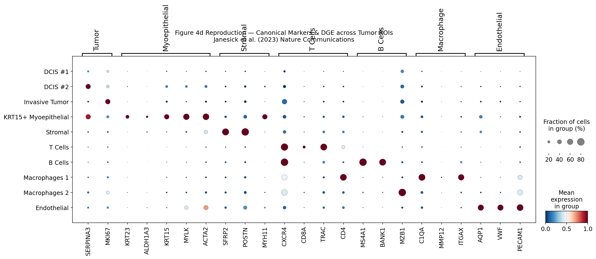

The dot plot displays 10 cell types against 7 gene-category columns. Each dot's size encodes the fraction of cells in that group expressing the gene; color encodes scaled mean expression (dark red = high, dark blue = low).

Several patterns stand out clearly in the reproduction:

**Tumor rows (DCIS #1, DCIS #2, Invasive Tumor)** are transcriptionally sparse against non-tumor marker genes, confirming they do not aberrantly co-express immune or stromal programs. Among the tumor genes, **DCIS #2** shows the strongest **SERPINA3** signal which is a serine protease inhibitor associated with a more secretory, luminal tumor phenotype. The Invasive Tumor row shows the broadest activation across tumor markers, consistent with the proliferative state expected in invasive carcinoma.

**KRT15+ Myoepithelial** cells dominate the Myoepithelial gene column, with large dark-red dots at **KRT15**, **MYLK**, and **ACTA2**. This is biologically consistent: KRT15 is a basal/myoepithelial identity marker, and its retention at high levels in this population confirms an intact myoepithelial phenotype. Notably, the DCIS #1 and DCIS #2 rows show only faint myoepithelial signal, confirming these are epithelial tumor populations rather than myoepithelial ones.

**Stromal cells** show large dots at **SFRP2** and **POSTN** (canonical cancer-associated fibroblast markers) with the Stromal row cleanly separated from all other groups in this column.

**T Cells** resolve sharply through **CXCR4**, **TRAC**, and **CD4**, with large dots concentrated in those three genes. **B Cells** are defined by **MS4A1** and **BANK1**, while **MZB1** (a plasma cell differentiation marker) is most concentrated in the B Cells row, consistent with its role as a late B-cell maturation gene. MZB1's presence near DCIS #1 in the violin analysis (below) reflects a spatial proximity or co-enrichment of plasma B cells in that ROI rather than tumor cell expression.

**Macrophage subtypes** (1 and 2) differ in their C1QA and ITGAX distributions. MMP12, a macrophage-secreted metalloproteinase, is nearly absent across all rows, which is addressed further in the violin section. **Endothelial cells** are cleanly separated by **VWF**, **PECAM1**, and **AQP1**, providing a reliable internal positive control for vascular cell identity.

---

#### Supplementary Heatmap - Top DGE Genes per Tumor Subtype

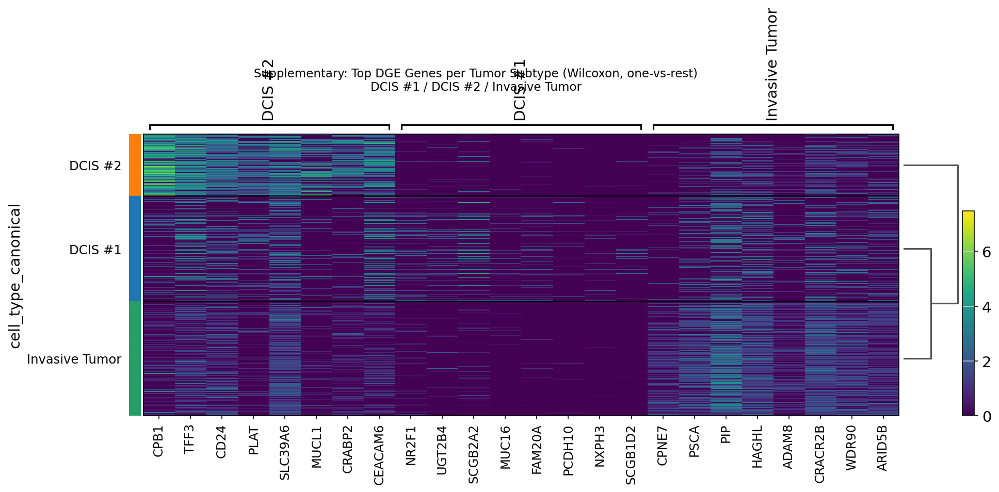

The heatmap shows the top 8 upregulated genes (Wilcoxon, one-vs-rest, p_adj < 0.05, log2FC ≥ 1) for each of the three tumor subtypes, with individual cells as rows and genes as columns. The viridis color scale represents log-normalized expression.

**DCIS #2** (orange bar) is defined by **CPB1**, **TFF3**, **CD24**, **PLAT**, **SLC39A6**, **MUCL1**, **CRABP2**, and **CEACAM6**. CPB1 (carboxypeptidase B1) and TFF3 (trefoil factor 3) are secretory luminal markers — their enrichment in DCIS #2 is consistent with this subtype showing a more secretory, luminal identity. CEACAM6, a cell adhesion molecule frequently upregulated in invasive-tending DCIS, is notable here as a potential marker of elevated invasion risk in this subtype.

**DCIS #1** (blue bar) is defined by **NR2F1**, **UGT2B4**, **SCGB2A2**, **MUC16**, **FAM20A**, **PCDH10**, **NXPH3**, and **SCGB1D2**. SCGB2A2 (mammaglobin) and SCGB1D2 are canonical luminal breast markers, while NR2F1 is a nuclear receptor associated with a stem-like state in cancer. The presence of PCDH10 (protocadherin 10, frequently silenced in invasive cancers) in the DCIS #1 signature is particularly interesting - it may contribute to the contained, non-invasive character of this subtype.

**Invasive Tumor** (green bar) is marked by **CPNE7**, **PSCA**, **PIP**, **HAGHL**, **ADAM8**, **CRACR2B**, **WDR90**, and **ARID5B**. ADAM8 is a disintegrin-metalloprotease associated with tumor cell migration and invasion, making its exclusive enrichment in the Invasive Tumor subtype biologically apt. PSCA (prostate stem cell antigen) has been observed in invasive breast cancer. The Invasive Tumor cells cluster close to DCIS #1 on the dendrogram (right side), while DCIS #2 branches separately, suggesting that at the transcriptome level DCIS #1 and Invasive Tumor share a closer lineage than either does with DCIS #2.

---

#### Violin Plots - Key Differentially Expressed Genes

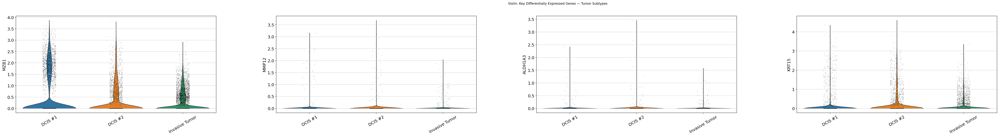

The violin plots show the distribution of log-normalized expression for four genes across DCIS #1, DCIS #2, and Invasive Tumor.

**MZB1** is most highly expressed in DCIS #1, with a broader distribution and more high-expressing cells than DCIS #2 or Invasive Tumor. While MZB1 is primarily a plasma cell marker, its enrichment near DCIS #1 in the single-cell data is consistent with the paper's finding that DCIS #1 harbors a more active B-cell/plasma cell immune infiltrate in its microenvironment.

**MMP12** is essentially absent across all three tumor subtypes, which is expected — MMP12 is a macrophage-secreted metalloproteinase, not a tumor cell marker. Its near-zero expression here confirms that the DGE is cleanly reflecting cell-intrinsic tumor programs rather than contaminating macrophage signal. The paper's finding that MMP12 is absent in the Invasive ROI refers to the macrophage population within that region, which is appropriately captured in the dot plot (Macrophages rows) rather than in the tumor-subtype DGE.

**ALDH1A3** is highest in DCIS #1, with a pronounced right tail of high-expressing cells, and drops off in DCIS #2 and Invasive Tumor. ALDH1A3 is a marker of luminal progenitor and cancer stem-like cells, and its gradient across the three subtypes — high in DCIS #1, lower in invasive disease — suggests a progressive loss of a progenitor-like identity as the tumor transitions toward invasion.

**KRT15** follows the same gradient as ALDH1A3: highest in DCIS #1, substantially reduced in DCIS #2, and near-absent in Invasive Tumor. KRT15 marks basal/myoepithelial progenitors, and its loss mirrors the breakdown of myoepithelial identity that the paper identifies as a hallmark of the DCIS-to-invasion transition. Together, the ALDH1A3 and KRT15 violins provide strong single-cell support for the paper's central claim that DCIS #1 retains a more intact, progenitor-enriched microenvironment compared to the more invasive subtypes.

---

### Dependencies

```
scanpy
matplotlib
seaborn
anndata
pandas==2.2.2
openpyxl
gdown
```

Install with:
```bash
pip install scanpy matplotlib seaborn openpyxl anndata pandas==2.2.2 gdown
```

---

## Visium CytAssist Spatial Analysis

### What This Section Covers

This section covers the Visium CytAssist spatial transcriptomics pipeline. The goal was to load and process the published Visium dataset for the FFPE breast cancer sample, apply the official cell type annotations provided by the authors and reproduce the spatial cluster map and spatial gene expression plots from Figures 2b and 2c of the paper.

### Why Spatial Context Matters

The scFFPE-seq data produced by single-cell sequencing tells you a great deal about what cell types are present in a tumor and what those cells are expressing but it cannot tell you anything about where those cells are located relative to each other. That spatial relationship is not a minor detail. In cancer biology the neighborhood a cell lives in directly influences its behavior. A tumor cell sitting at the edge of a duct surrounded by myoepithelial cells is in a fundamentally different microenvironment than one that has already broken through into the surrounding stroma and you cannot observe that distinction from dissociated single-cell data alone.

Visium CytAssist fills this gap by preserving the tissue architecture and attaching spatial coordinates to gene expression measurements. Every sequenced spot on the Visium slide corresponds to a physical location on the tissue section and that location can be overlaid directly on the H&E image of the same tissue. This makes it possible to see exactly which duct a cluster of spots expressing a DCIS marker corresponds to and to map molecular heterogeneity onto recognizable histological structures.

### Data and Files Used

The following files were downloaded from the 10x Genomics dataset page for this paper:

| File | Purpose |
|------|---------|
| `CytAssist_FFPE_Human_Breast_Cancer_filtered_feature_bc_matrix.h5` | Gene expression matrix |
| `CytAssist_FFPE_Human_Breast_Cancer_spatial.tar.gz` | Tissue image and spot coordinates |
| `CytAssist_FFPE_Human_Breast_Cancer_analysis.tar.gz` | Pre-computed clustering |
| `Cell_Barcode_Type_Matrices.xlsx` | Official cell type annotations from the authors |

The annotation Excel file contains a Visium sheet with three columns: barcode, cluster number and cell type annotation. These are the exact annotations used in the paper so no manual cluster labeling was needed.

### Pipeline Summary

The data was loaded using `scanpy.read_visium` which reads the expression matrix and spatial folder together registering the H&E image and spot coordinates in a single AnnData object. After verifying the tissue image loaded correctly standard preprocessing was applied including gene filtering to remove genes detected in fewer than 3 spots, normalization to 10,000 counts per spot and log transformation.

Cell type annotations were loaded from the Excel file and mapped onto each spot barcode. The Visium dataset contains 4,992 spots under tissue covering 11 annotated cell type categories. These include DCIS #1, DCIS #2, invasive tumor, adipocytes, immune cells, stromal cells, stromal/endothelial cells and mixed composition spots representing regions where multiple cell types coexist within the 55 µm capture diameter of a single spot.

### Understanding the Mixed vs Unequivocal Clusters

The distinction between the unequivocally annotated spots and the mixed spots is not a limitation of the data processing. It is an honest reflection of the tissue biology. In a tumor section many cell types are physically intermingled. A spot sitting at the edge of a duct simultaneously captures transcripts from the ductal epithelium inside, the myoepithelial layer wrapping around it and the stromal cells just outside. No spatial technology at this resolution can cleanly separate those signals without additional single-cell reference data which is exactly why the scFFPE-seq annotations were essential for interpreting the Visium output.

### Reproduced Figure 2b — Spatial Cluster Map

The figure below reproduces the spatial cluster map from Figure 2b of the paper. Each circle represents one Visium spot and the color indicates the cell type annotation assigned by the authors. The invasive tumor region (red) is clearly visible in the upper right portion of the tissue. The large yellow cluster on the left corresponds to adipocytes. DCIS #1 (blue) sits at the bottom center and the stromal and endothelial populations spread across large portions of the tissue. Mixed spots (grey) appear where multiple cell types coexist in close spatial proximity.

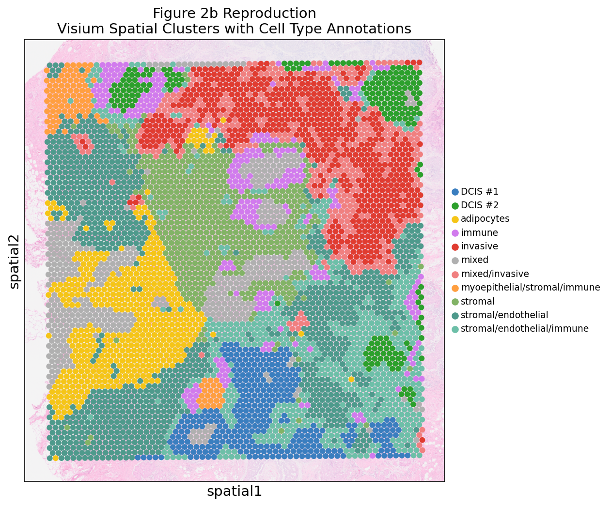

This pattern is consistent with Figure 2b in the paper. The spatial organization of the tumor subtypes relative to each other and to the surrounding stromal and immune compartments matches the published result.

### Reproduced Figure 2c — Spatial Marker Gene Expression

Figure 2c from the paper shows spatial expression maps for eight marker genes each representing a different cell type. The combined panel below reproduces all eight maps.

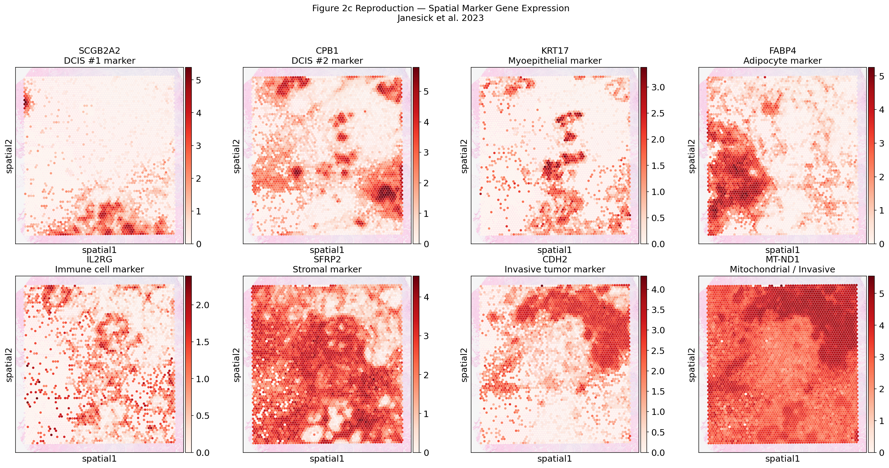

Each gene is also shown individually below with a brief interpretation of what the spatial pattern confirms.

**SCGB2A2 — DCIS #1 marker**

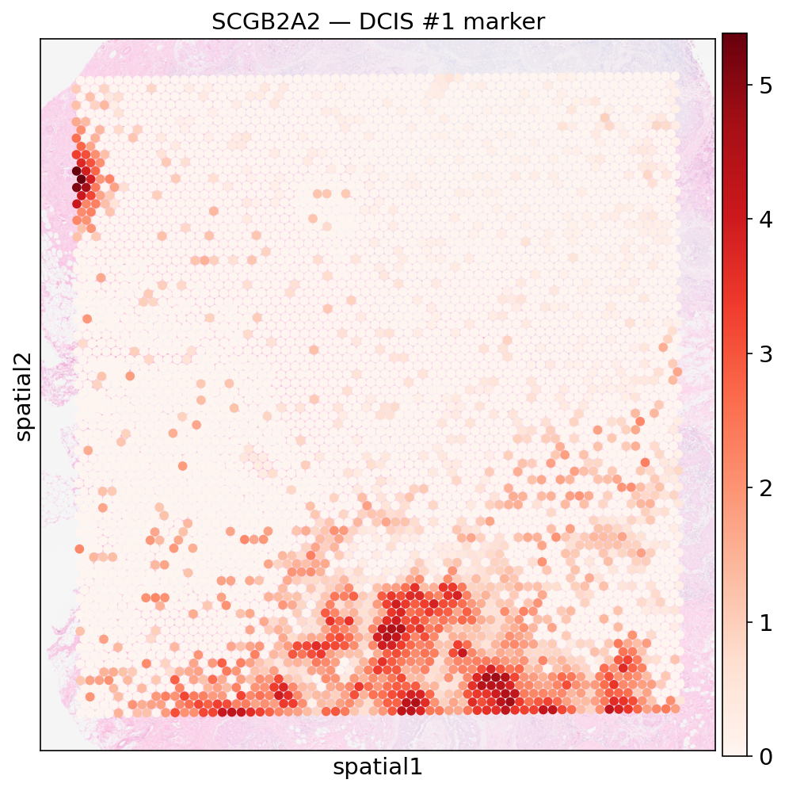

SCGB2A2 expression is concentrated in the lower portion of the tissue in a spatially coherent cluster that overlaps with the DCIS #1 annotation in Figure 2b. This confirms that this ductal region has a molecularly distinct identity from the rest of the tumor.

**CPB1 — DCIS #2 marker**

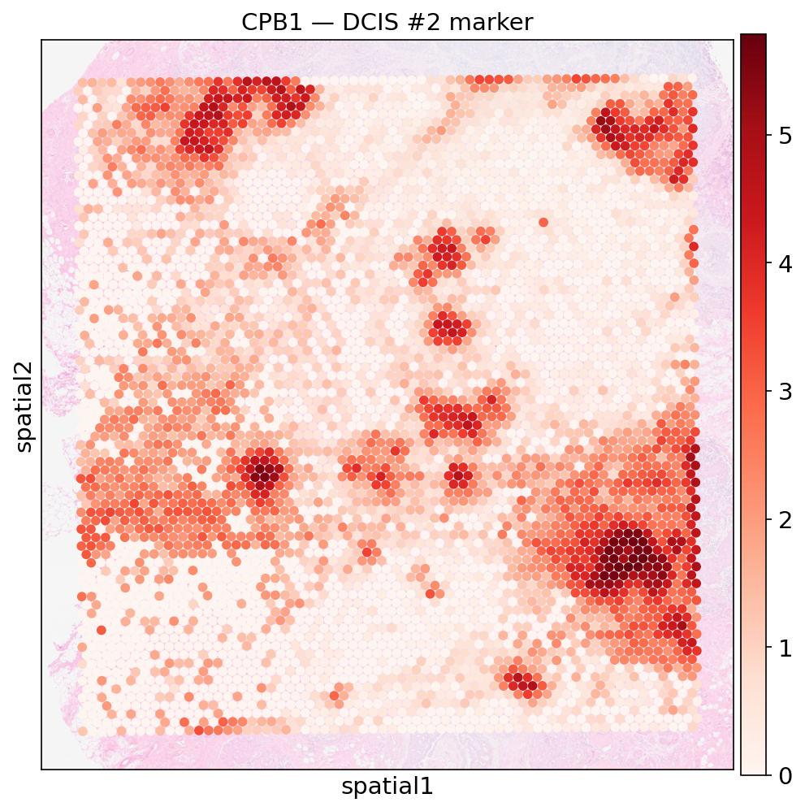

CPB1 shows a more dispersed pattern across the tissue with hotspots in the upper corners and scattered foci throughout. This is consistent with the paper's description of DCIS #2 as a region with invasive carcinoma lesions scattered throughout the stromal connective tissue.

**KRT17 — Myoepithelial marker**

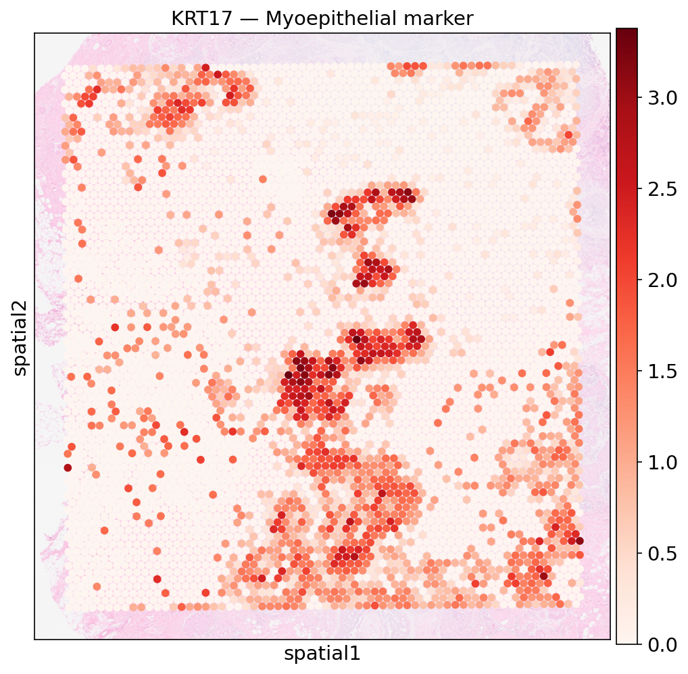

KRT17 expression forms thin elongated clusters that wrap around ductal structures visible in the H&E image. This ring-like spatial pattern is exactly what would be expected for the myoepithelial layer which physically surrounds the ductal epithelium as a boundary cell population.

**FABP4 — Adipocyte marker**

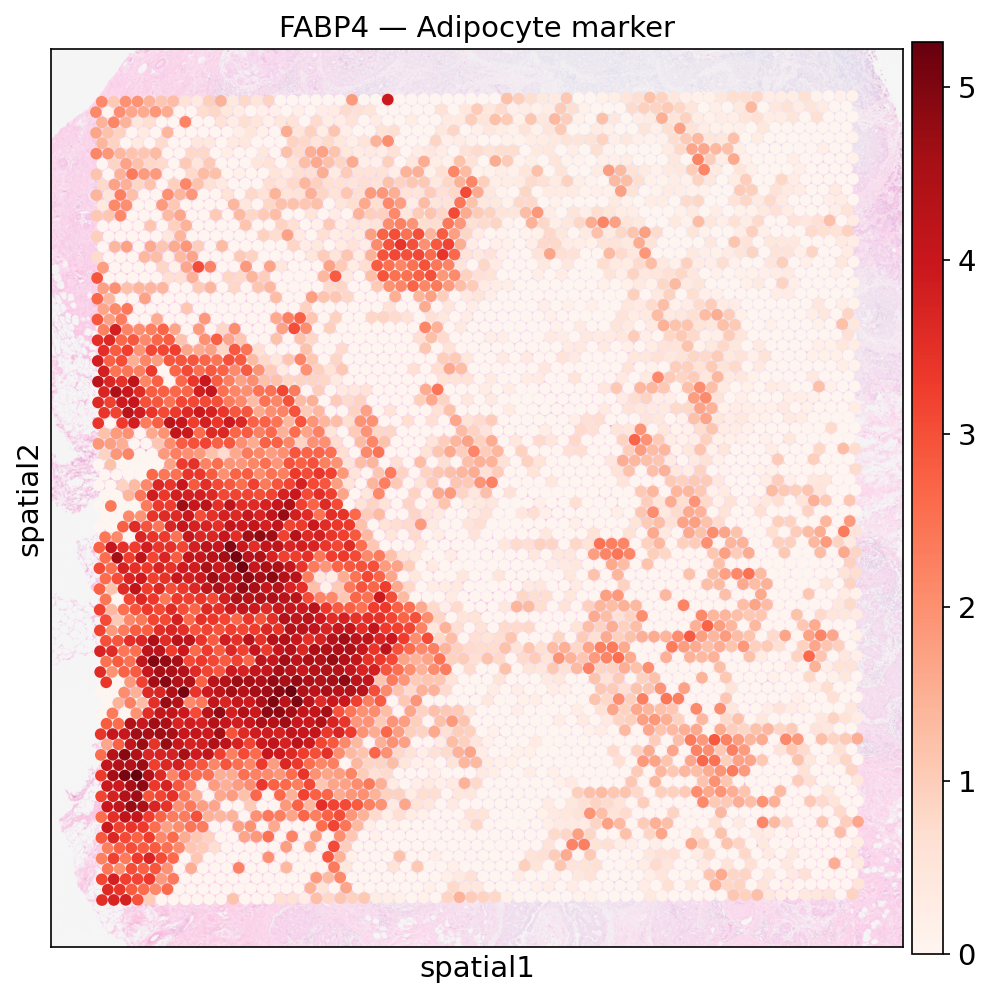

FABP4 is strongly expressed in the left portion of the tissue in a large contiguous region that corresponds to the yellow adipocyte cluster in Figure 2b. This confirms that Visium successfully captured adipocyte transcripts despite the fact that adipocytes are notoriously difficult to recover with dissociation-based single-cell methods because they rupture during tissue processing.

**IL2RG — Immune cell marker**

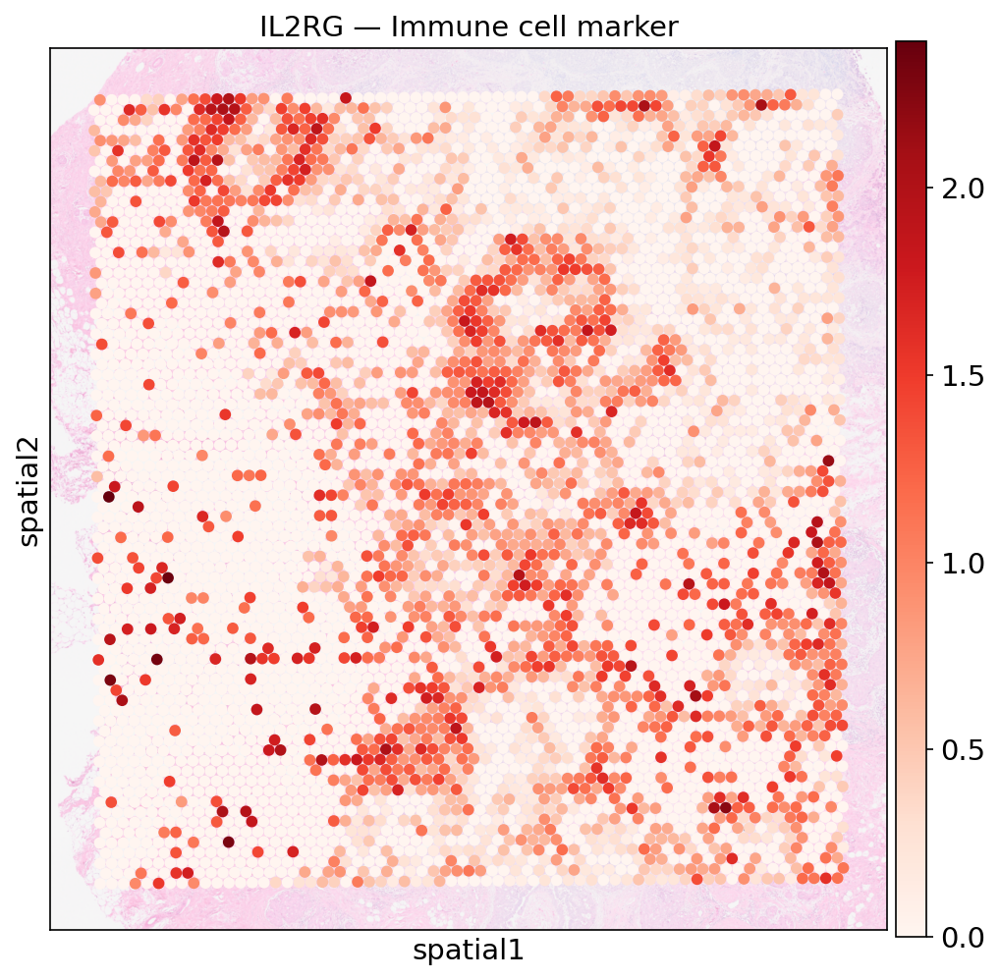

IL2RG expression is scattered as small foci across the tissue rather than forming large contiguous regions. This dispersed pattern is consistent with the biology of immune infiltration in breast tumors where lymphocytes and macrophages are distributed throughout the tumor microenvironment rather than forming solid masses.

**SFRP2 — Stromal marker**

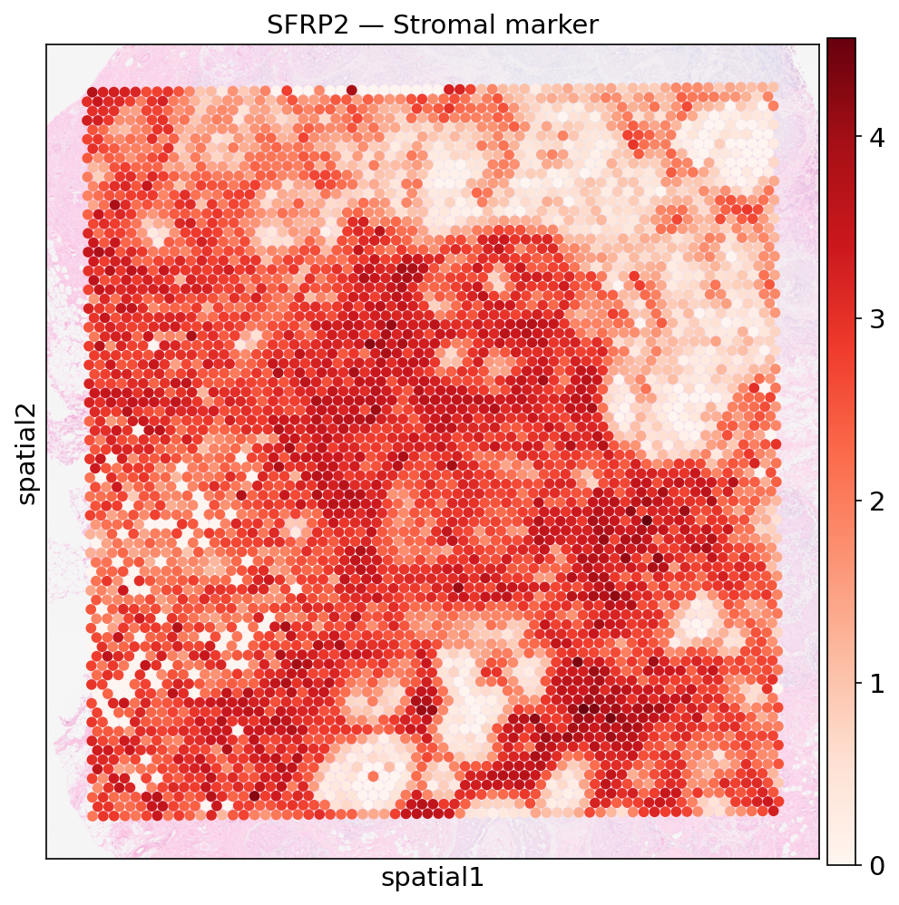

SFRP2 is broadly expressed across a large central region of the tissue with areas of high expression forming an interconnected stromal network. This broad distribution reflects the stromal compartment that surrounds and separates the ductal and invasive tumor regions.

**CDH2 — Invasive tumor marker**

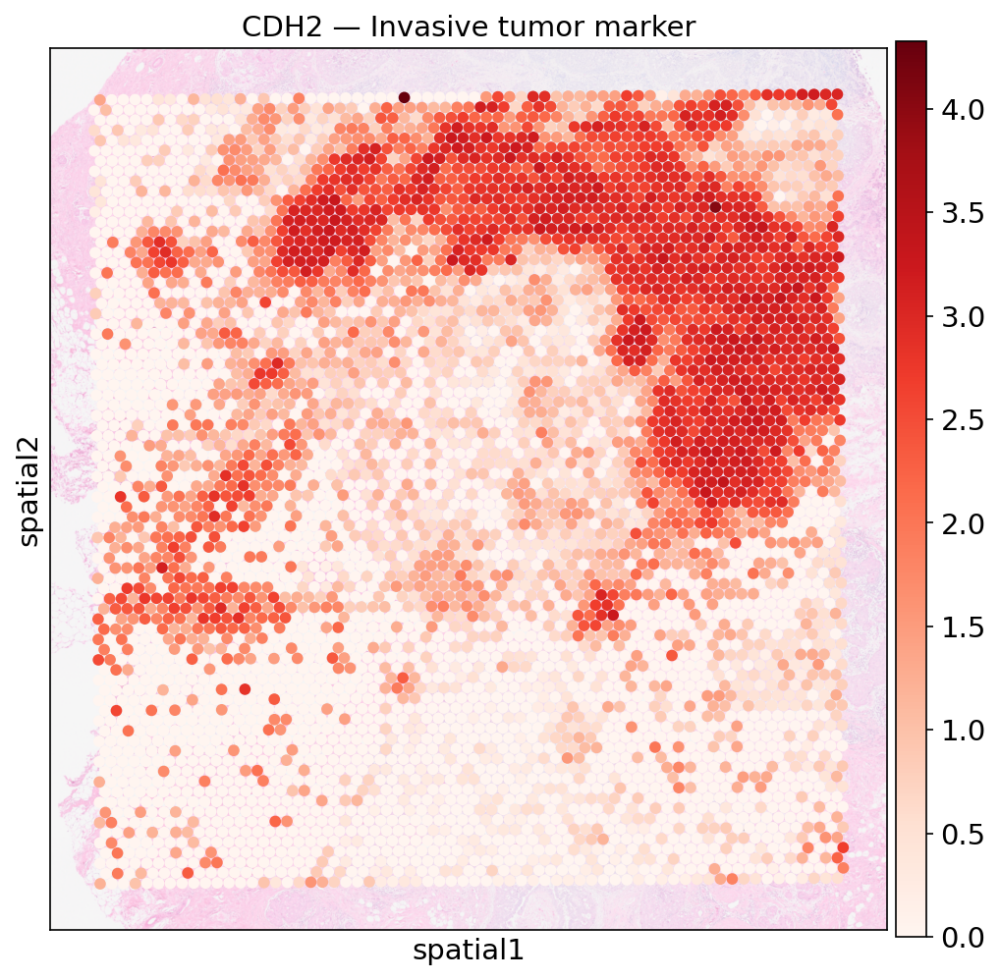

CDH2 shows strong expression concentrated in the upper right quadrant of the tissue with a clear boundary separating high-expressing spots from low-expressing spots. This high-expressing region spatially overlaps with the invasive annotation in Figure 2b confirming that CDH2 marks the invasive front of the tumor.

**MT-ND1 — Mitochondrial / Invasive**

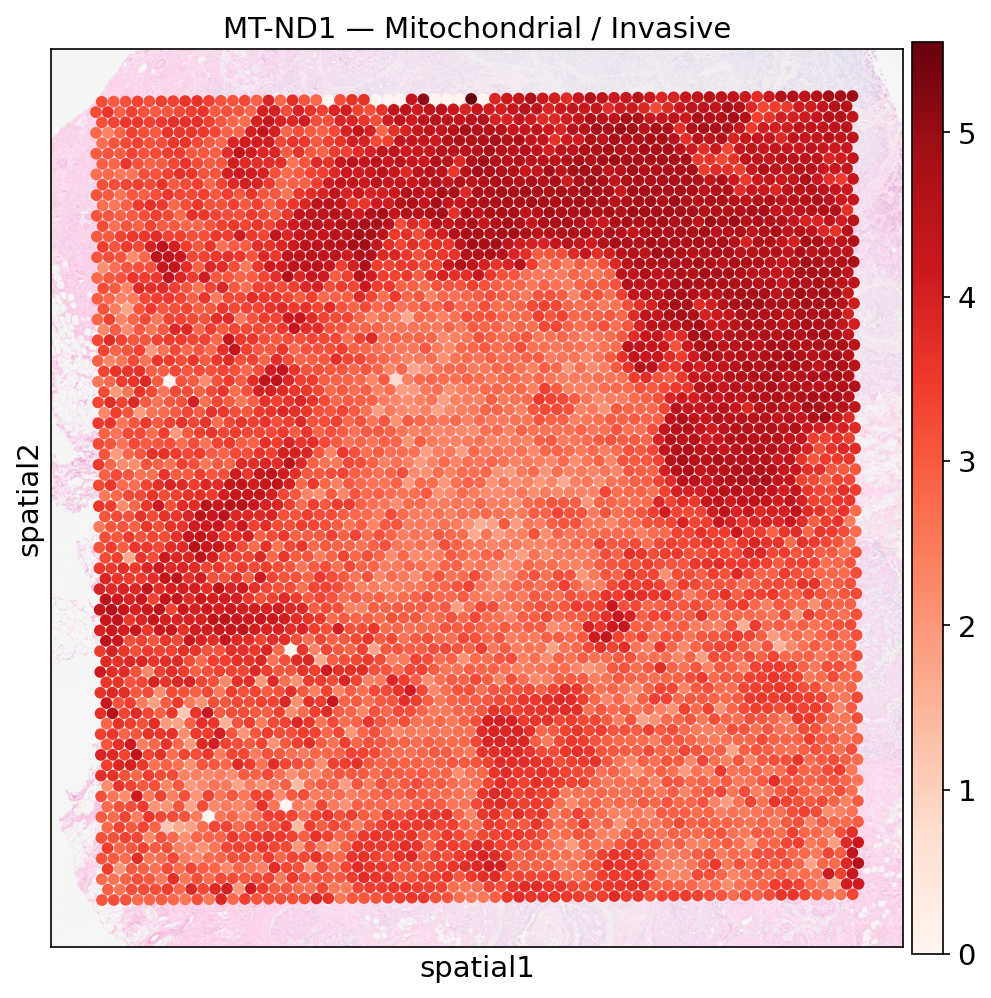

MT-ND1 is broadly expressed across the tissue but with the highest intensity in the invasive tumor region. The paper noted that mitochondrial gene expression correlates with the invasive region which is consistent with the elevated metabolic activity expected in actively invading cancer cells. This pattern is reproduced here.

### Key Statistics Verified

| Metric | Paper Reports | Reproduced |
|--------|--------------|------------|
| Spots under tissue | 4,992 | 4,992 |
| Median genes per spot | 5,712 | 5,712 |
| Mean reads per spot | 40,003 | 40,003 |
| Cell type categories | 11 | 11 |
| Genes in probe set | 18,536 | 18,085 (after filtering) |

### Notebook

The full analysis notebook is available at:
`notebooks/Visium_Analysis.ipynb`

---

## Member 4 — Xenium In Situ

> **Placeholder** — to be completed by Member 4.
>
> This section will cover the Xenium in situ pipeline, cell segmentation, subcellular spatial resolution analysis and reproduction of Figure 3b showing spatial gene expression maps at single-cell resolution.

---

## Data Availability

All datasets used in this reproduction are publicly available:

- Processed Visium and Xenium datasets: [10x Genomics Human Breast Preview Dataset](https://www.10xgenomics.com/products/xenium-in-situ/preview-dataset-human-breast)
- Raw sequencing data: [GEO accession GSE243280](https://www.ncbi.nlm.nih.gov/geo/query/acc.cgi?acc=GSE243280)
- Author companion code: [GitHub — 10XGenomics/janesick_nature_comms_2023_companion](https://github.com/10XGenomics/janesick_nature_comms_2023_companion)

---

## Citation

Janesick A, Shelansky R, Gottscho AD, et al. High resolution mapping of the tumor microenvironment using integrated single-cell, spatial and in situ analysis. *Nature Communications*. 2023;14:8353. https://doi.org/10.1038/s41467-023-43458-x
